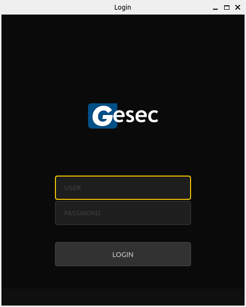

<h1 align="center">
    
</h1>

<h2 align="center">Gesec Desafio</h2>

<p align="center">
  <a href="#bookmark-layout">Layout</a>&nbsp;&nbsp;&nbsp;|&nbsp;&nbsp;&nbsp;
  <a href="#rocket-tecnologias">Tecnologias</a>&nbsp;&nbsp;&nbsp;|&nbsp;&nbsp;&nbsp;
  <a href="#computer-projeto">Projeto</a>&nbsp;&nbsp;&nbsp;|&nbsp;&nbsp;&nbsp;
  <a href="#package-instalação">Instalação</a>&nbsp;&nbsp;&nbsp;|&nbsp;&nbsp;&nbsp;    
</p>

<p align="center">
   
     
</p>

<br>

## :rocket: Tecnologias

Esse projeto foi desenvolvido utilizando as seguintes tecnologias:
-  **[Node.js](https://nodejs.org/)**
-  **[Express](https://expressjs.com/)**
-  **[Python](https://www.python.org/)**
-  **[Pyqt5](https://www.riverbankcomputing.com/static/Docs/PyQt5/)**
-  **[Mongodb](https://www.mongodb.com/)**

## :computer: Projeto

Projeto de programa desktop para vizualização de videos que se comunica com backend feito em node.

## :package: Instalação

### :heavy_check_mark: **Pré-requisitos**

Os seguintes softwares devem estar instalados:
  
  - **[Node.js](https://nodejs.org/en/)**
  -  **[Python versão 3.9](https://www.python.org/)**
  - **[Git](https://git-scm.com/)**
  - **[Docker](https://www.docker.com/)**
  - **[Docker Compose](https://docs.docker.com/compose/)**

<br>
  
### :arrow_down: **Clonando o repositório**

```sh
  $ git clone https://github.com/edno2819/Teste_gesec
```

<br>

### :arrow_forward:	**Rodando as aplicações**

- :package: API

```sh
  cd Backend
  # Constrói uma imagem a partir de um Dockerfile e de um contexto
  docker-compose build
  # Instalar as dependências
  npm install
  # Inicia os containers
  docker-compose --env-file ./.env up
```

- : Desktop app

```sh
  $ cd Desktop
  # Dependencies install.
  pip install -r requirements.txt
  # Running app
  $ python main.py
```
- Lembresse de possuir a versão <=3.9 do python para evitar conflitos com PyQT5.

<br>

- Criar executável

```sh
  $ auto-py-to-exe
```
```
Escolha o arquivo main.py
Onefile: One Directory
Console Window: Console Based
Additional Files:
    adicione o .env do projeto desktop
    Advanced: --name: Escolha o nome que desejar
```

- Criar um usuário para teste

```py
  # Descomente a linha 'api.Register('admin', '123456')' no arquivo main.py
    app = QApplication(sys.argv)
    api = RequestsBack()

    # Create user - for testing purposes
    #api.Register('admin', '123456')

    navigation = Navigation()
```
<br>

<p align="center">Desenvolvido com 💜 por Edno Almeida</p>
